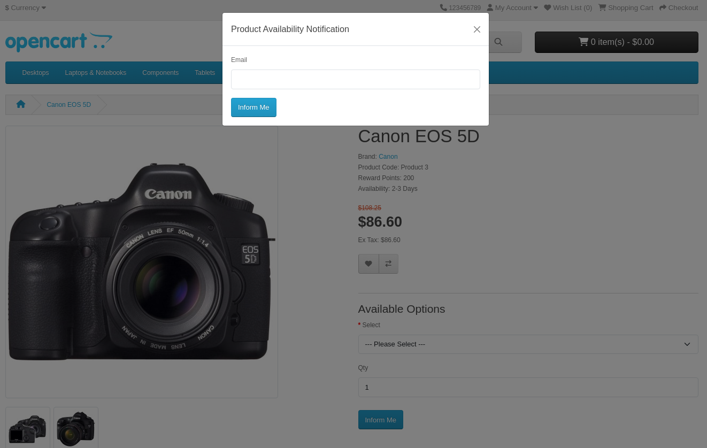
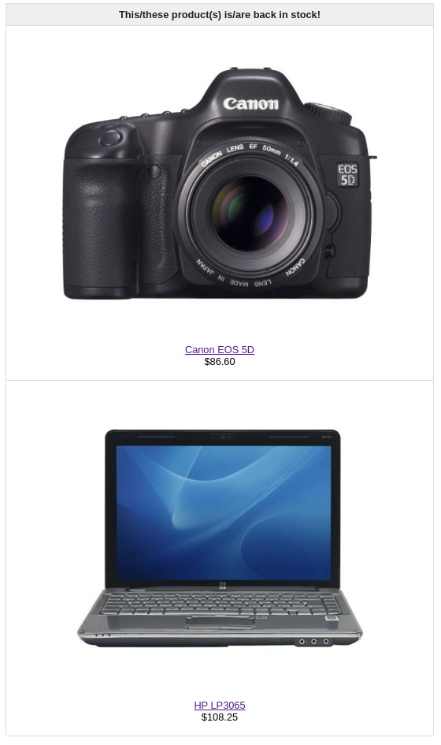
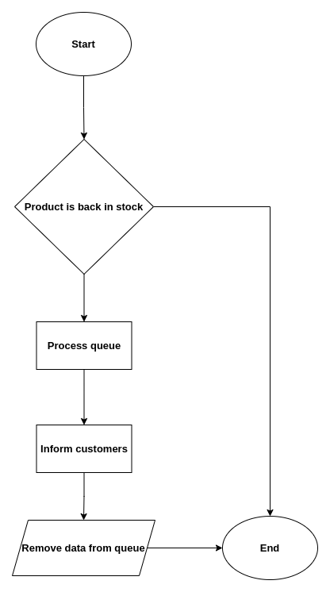
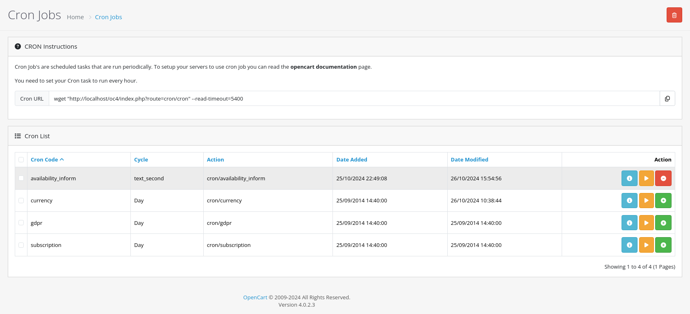

# OpenCart Product Availability Notification Documentation

This document details the implementation of a "Product Availability Notification" feature for OpenCart. This feature ensures that customers can subscribe to notifications for out-of-stock products and receive emails when those products are back in stock. Additionally, server-side validation is in place to prevent duplicate subscriptions and ensure only subscribed customers are notified in a balanced and controlled manner.

---

## Feature Overview

- **Inform Me Button:** When a product is out of stock, the "Add to Cart" button is disabled, and an "Inform Me" button is displayed. This allows customers to sign up for notifications when the product is restocked.
- **Customer Subscription:** Clicking the "Inform Me" button opens a form where customers enter their email to subscribe. The system validates the email and stores it in the database with the corresponding product ID.
- **Cron-Managed Email Notifications:** Once products are back in stock, a cron job processes queued emails and sends notifications in batches to avoid spamming and manage server load.
- **Unique Subscription Validation:** Each customer can only subscribe to a product once, preventing duplicate entries in the queue.

---

## Implementation Details

### 1. Frontend Changes: Displaying the Inform Me Button

- When a product’s stock level is zero (out of stock), the "Add to Cart" button is replaced by an "Inform Me" button.
- The button is conditionally rendered based on the product’s stock status.

**Frontend Display Example:**


### 2. Customer Subscription: Collecting Email and Product ID

- Upon clicking the "Inform Me" button, a modal form opens, prompting the customer to enter their email.
- The form submission sends the email and product ID to a controller function that validates and stores it.

**Email Example:**


### 3. Server-Side Validation

- **Out-of-Stock Product Validation:** A server-side check is added to ensure products with zero stock cannot be added to the cart.
- **Duplicate Subscription Prevention:** Validation is added to prevent customers from subscribing multiple times to the same product.

### 4. Processing the Email Queue with Cron

- **Cron Mechanism:** The cron job processes a batch of emails at regular intervals, which can be configured via the server's cron tab or executed via OpenCart’s admin panel.
- **Balanced Queue Processing:** Each run of the cron job processes a limited number of emails to prevent server overload and spamming.

**Daemon Diagram:**


**Setting up the Cron Job:**
You can either set up the cron job through the server or via OpenCart’s admin panel:

1. **Server Cron Job:**
   - Set up a cron job on your server to execute `/index.php?route=cron/cron` periodically.
   - Example (executing every 5 minutes):
     ```bash
     */5 * * * * /usr/bin/php /path/to/your/opencart/index.php?route=cron/cron
     ```

2. **OpenCart Admin Panel:**
   - Open the OpenCart admin panel, navigate to **Extensions > Cron Jobs**, and schedule the `cron/cron` route to be triggered periodically.

**Cron Section in OpenCart:**


---

## NOTE
This is an assignment project for a company.
